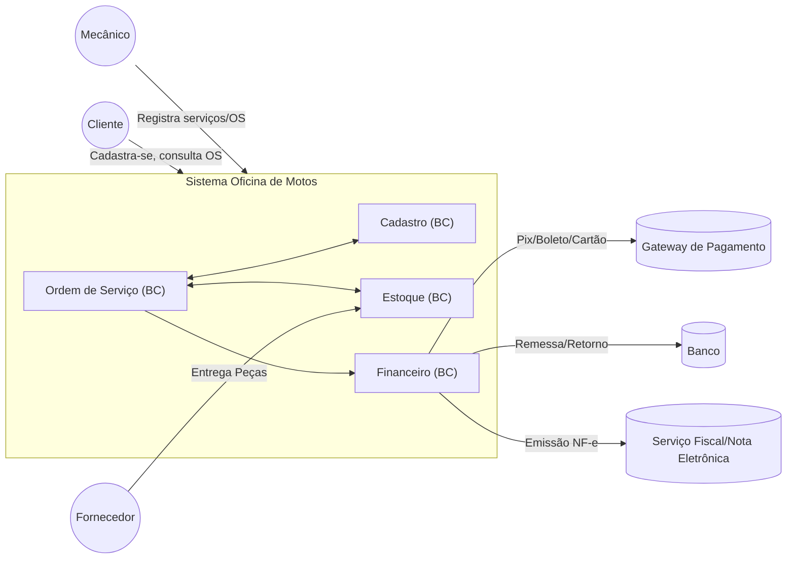
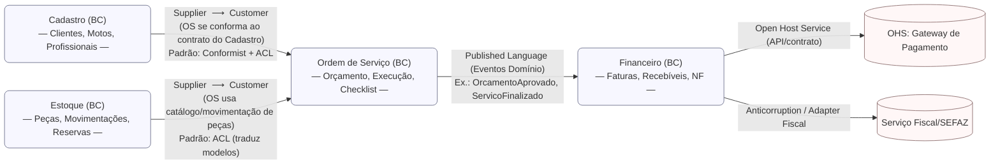
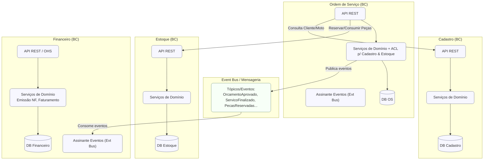

# Oficina de Motos — Bounded Contexts (C4 + Context Map)

Abaixo estão três diagramas em **Mermaid** para visualizar os **Bounded Contexts** do sistema da oficina:
1) **C4 — Contexto do Sistema (L1)**,
2) **DDD Context Map** (relações estratégicas),
3) **C4 — Contêineres (L2) focado em integração entre BCs**.

---

## 1) C4 — Contexto do Sistema (L1)

---

## 2) DDD Context Map — Relações Estratégicas entre BCs

**Legenda rápida dos padrões:**
- **Customer/Supplier:** um BC (Customer) depende do contrato/saídas do outro (Supplier).
- **Conformist:** o Customer adota (se conforma) ao modelo do Supplier para reduzir acoplamento de tradução.
- **ACL — Anti-Corruption Layer:** camada de tradução/isolamento para proteger o modelo interno.
- **Published Language:** integração assíncrona por eventos com linguagem/eventos publicados.
- **OHS — Open Host Service:** serviço aberto com contrato explícito para integração.

---

## 3) C4 — Contêineres (L2) com foco de integração

---

### Notas de implementação
- **Autonomia por BC:** cada BC pode ter seu **repositório, pipeline CI/CD, banco** e **versionamento de contrato**.
- **Sincronismo vs Assíncrono:**
  - **Leituras** de referência (ex.: dados do cliente/peça) podem ser síncronas (REST).
  - **Fluxos de negócio** entre OS → Financeiro/Estoque preferem **eventos** (acoplamento menor e resiliência).
- **Observabilidade:** propagar **correlation-id** entre BCs, métricas e traces (OpenTelemetry) para rastrear uma OS ponta a ponta.
- **Evolução Segura:** introduza **ACL** quando modelos começarem a “vazar” entre contextos.

---

Se quiser, eu posso gerar **PlantUML** ou **diagramas C4-Plant** equivalentes, ou ainda transformar isso em um **PPT** executivo com as legendas e padrões ressaltados.

